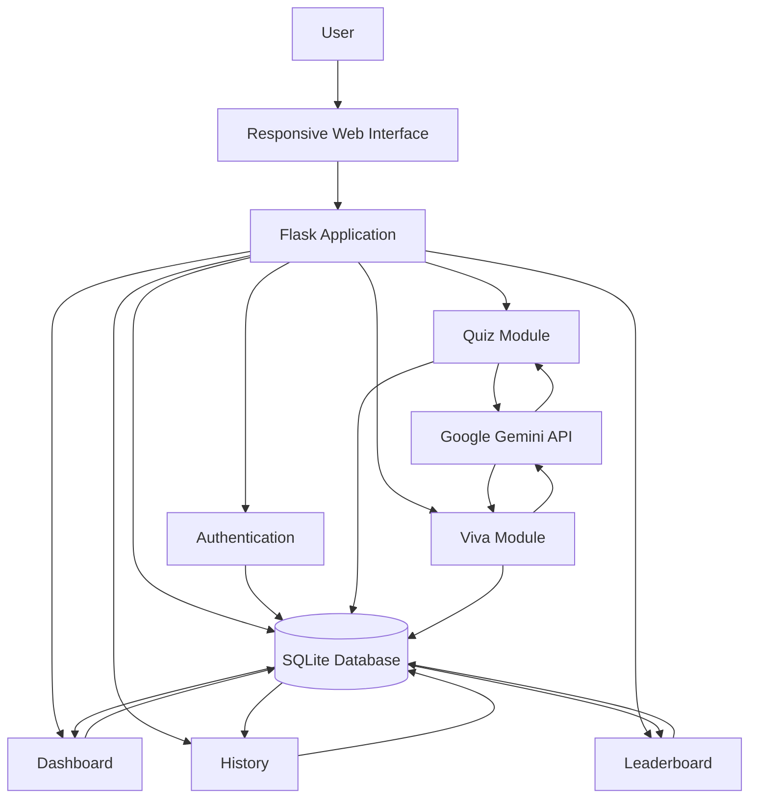

# 🎓 LearnIQ – AI-Powered Learning & Quiz Platform

<div align="center">


An AI-powered learning platform that generates personalized quizzes and viva questions using **Google Gemini AI**, helping students practice, analyze their performance, and improve their learning experience.

🌐 **Live Demo:** https://learniq-xpvc.onrender.com

</div>

---

# 📖 Overview

LearnIQ is an AI-powered web application built using **Python Flask** that enables students to generate quizzes and viva questions on any topic using Google's Gemini AI.

The platform provides:

- 🤖 AI-generated quizzes
- 🎤 AI Viva Practice
- 📊 Performance Dashboard
- 🏆 Leaderboard
- 📚 Assessment History
- 🌙 Dark Mode
- 📱 Responsive UI
- 📈 Learning Analytics

---

# ✨ Features

## Authentication
- Secure Login
- User Registration
- Session Management
- Logout

---

## AI Quiz Generator

- Generate quizzes using Google Gemini AI
- Topic-based questions
- Instant evaluation
- Score calculation

---

## AI Viva Practice

- AI-generated viva questions
- Interactive answering
- Performance evaluation

---

## Dashboard

- Quiz statistics
- Learning analytics
- Average score
- Highest score
- Continue learning

---

## History

- Previous assessments
- Scores
- Topics
- Completion dates

---

## Leaderboard

- Top-performing users
- Performance ranking
- Best scores

---

## Responsive Design

- Desktop
- Tablet
- Mobile

---

# 🏗 System Architecture



---

# ⚙ Tech Stack

## Frontend

- HTML5
- CSS3
- Bootstrap 5
- JavaScript
- Jinja2 Templates

---

## Backend

- Python
- Flask

---

## Database

- SQLite

---

## AI Integration

- Google Gemini API

---

## Deployment

- Render

---

## Version Control

- Git
- GitHub

---

# 📂 Project Structure

```
LearnIQ
│
├── static/
│   ├── style.css
│   ├── logo.png
│   ├── logo_icon.png
│
├── templates/
│   ├── base.html
│   ├── dashboard.html
│   ├── history.html
│   ├── leaderboard.html
│   ├── login.html
│   ├── profile.html
│   ├── quiz.html
│   ├── register.html
│   ├── result.html
│   ├── viva.html
│   └── viva_result.html
│
├── app.py
├── database.py
├── gemini_service.py
├── requirements.txt
├── README.md
└── quiz_history.db
```

---

# 🚀 Installation

## Clone Repository

```bash
git clone https://github.com/harisraveen/LearnIQ.git
```

---

## Navigate to Project

```bash
cd LearnIQ
```

---

## Create Virtual Environment

### Windows

```bash
python -m venv venv
venv\Scripts\activate
```

### Linux / macOS

```bash
python3 -m venv venv
source venv/bin/activate
```

---

## Install Dependencies

```bash
pip install -r requirements.txt
```

---

## Configure Environment Variables

Create a `.env` file.

```env
GEMINI_API_KEY=YOUR_GOOGLE_GEMINI_API_KEY
```

---

## Run Application

```bash
python app.py
```

Application will run at

```
http://127.0.0.1:5000
```

---

# 📱 Screenshots

Add screenshots of:

- Login Page
- Registration
- Dashboard
- AI Quiz
- AI Viva
- Leaderboard
- History
- Mobile View

---

# 🔄 Workflow

```text
User
   │
   ▼
Login/Register
   │
   ▼
Dashboard
   │
   ├──────────────► Generate Quiz
   │                     │
   │                     ▼
   │              Gemini AI
   │                     │
   │                     ▼
   │               Quiz Result
   │
   ├──────────────► Viva Practice
   │                     │
   │                     ▼
   │              Gemini AI
   │
   ├──────────────► History
   │
   └──────────────► Leaderboard
```

---

# 🎯 Future Enhancements

- Email Verification
- Forgot Password
- PDF Report Export
- AI Study Roadmap
- Personalized Learning Recommendations
- Certificates
- Admin Dashboard
- PostgreSQL Support
- Google OAuth Login
- Docker Deployment

---

# 👨‍💻 Developer

**Haris Raveen S S**

- 🎓 B.Tech Information Technology
- 🏫 SRM Institute of Science and Technology

GitHub:
https://github.com/harisraveen

Live Demo:
https://learniq-xpvc.onrender.com

---

# 📄 License

This project is licensed under the **MIT License**.

---

<div align="center">

⭐ If you found this project useful, consider giving it a star!

</div>
